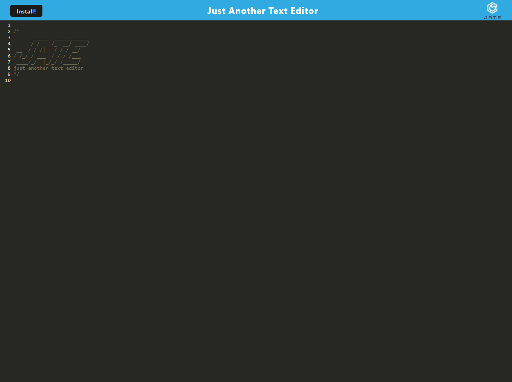

# Just Another Text Editor

## Description

The J.A.T.E. application is a basic Text Editing application for personal or professional use. As someone who wants to write code on the go it was important that I could write offline. So I wrote an update to this code to add a service worker to cache and allow me to install and use the program offline with my code.

[DEPLOYED-APPLICATION](https://nameless-river-91345.herokuapp.com/)

## Table of Contents

- [Installation](#installation)
- [Usage](#usage)
- [Credits](#credits)
- [License](#license)
- [Badges](#badges)

## Installation

First access the deployed application [here](https://nameless-river-91345.herokuapp.com/). Then click the given `Install!` button in the `top left` corner of your screen. Wait for the application to finish downloading and access the newly installed application.

## Usage

To use the app simply access the deployed application [here](https://nameless-river-91345.herokuapp.com/) or access the installed application which you installed in the previous section [Installation](#installation). Once open simply edit the text as you see fit. When you stop typing and click out of the tab it will automatically save anychanges to the page to a database for you to access later (Or offline).

## Credits

Main Text Editing Code: [Xandromus](https://github.com/Xandromus)
Service-Worker Implementation & Caching: [codeDevLogan](https://github.com/codeDevLogan)

## License

Copyright 2023 Logan Peterson

Permission is hereby granted, free of charge, to any person obtaining a copy of this software and associated documentation files (the “Software”), to deal in the Software without restriction, including without limitation the rights to use, copy, modify, merge, publish, distribute, sublicense, and/or sell copies of the Software, and to permit persons to whom the Software is furnished to do so, subject to the following conditions:

The above copyright notice and this permission notice shall be included in all copies or substantial portions of the Software.

THE SOFTWARE IS PROVIDED “AS IS”, WITHOUT WARRANTY OF ANY KIND, EXPRESS OR IMPLIED, INCLUDING BUT NOT LIMITED TO THE WARRANTIES OF MERCHANTABILITY, FITNESS FOR A PARTICULAR PURPOSE AND NONINFRINGEMENT. IN NO EVENT SHALL THE AUTHORS OR COPYRIGHT HOLDERS BE LIABLE FOR ANY CLAIM, DAMAGES OR OTHER LIABILITY, WHETHER IN AN ACTION OF CONTRACT, TORT OR OTHERWISE, ARISING FROM, OUT OF OR IN CONNECTION WITH THE SOFTWARE OR THE USE OR OTHER DEALINGS IN THE SOFTWARE.

## Badges

